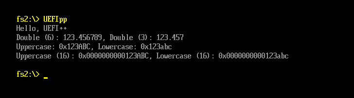

# UEFI++

UEFI++ is a modern, minimal C++ abstraction layer for UEFI firmware development, designed for out-of-the-box compilation using Microsoft Visual Studio.

**Tested with Microsoft Visual Studio 2026.**

UEFI++ intentionally provides only a small foundational core. Most functionality is expected to be implemented or extended by the user depending on the specific firmware use case.

---

## Goals

- Modern, minimal C++ implementation
- Out-of-the-box compilation using Microsoft Visual Studio
- No heavy or external build toolchains
- No CRT, no STL, no runtime dependencies
- Small core designed to be extended by the user

---

## Included

- **Console stream**
	- Stream-style interface for console output
	- Chained insertion operators (`<<`)
	- Support for base switching (hex/dec), width, fill, precision
	- Uppercase / lowercase formatting
	- Console-specific operations (e.g. screen clearing)

- **Serial stream**
	- Stream-style interface for serial output
	- Chained insertion operators (`<<`)
	- UTF-8 output support through the `UTF8` namespace
	- Same formatting and interface as the console stream

- **Memory utilities**
	- `new` and `delete` operator implementation

- **Command line arguments**
	- Access to UEFI load options as traditional `ArgC`/`ArgV`
	- UTF-16 to UTF-8 conversion
	- Quoted argument support
	- Escape handling inside quoted arguments

---

## Example Output

