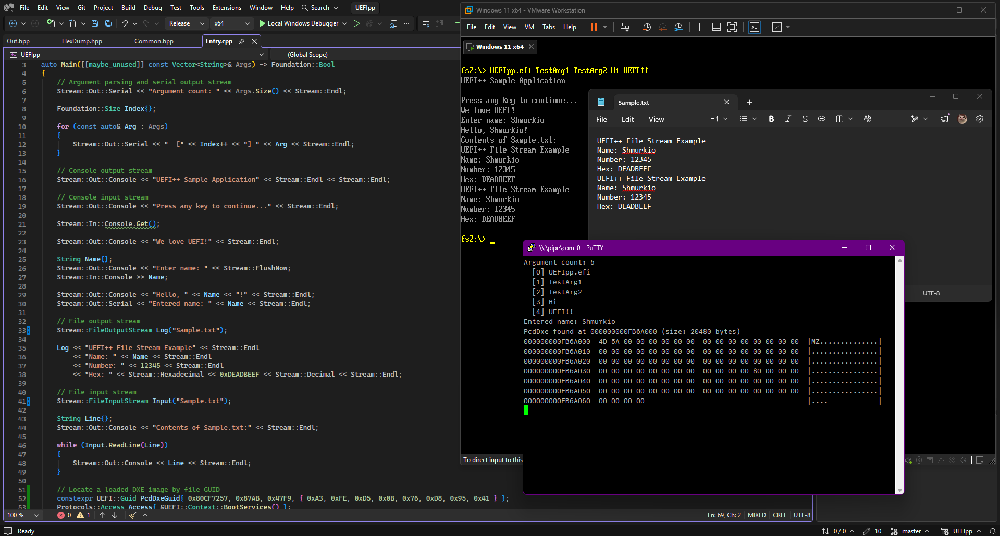

# UEFI++

UEFI++ is a C++ framework for developing UEFI applications, drivers,
and other firmware components using modern C++.

Compared to traditional UEFI development environments, UEFI++ provides
high-level C++ abstractions for common firmware tasks such as:

- Containers (`String`, `Vector`, `Optional`, `Span`)
- CRT compatibility layer
- Input (console, file) and output (console, serial, file) streams
- NVRAM access
- Filesystem operations
- Time and date handling
- Cryptography
- Memory management
- Reverse engineering utilities (pattern scanning, symbol resolution)
- PE image parsing

The framework is designed to build out-of-the-box using
Microsoft Visual Studio without requiring an EDK2-based build environment.

**Tested with Microsoft Visual Studio 2026 (/std:c++latest).**

---

## Showcase

The screenshot below shows a UEFI++ application running in the UEFI Shell,
demonstrating command-line argument parsing, console I/O, serial logging,
and file streams.

---

## Status

UEFI++ is currently undergoing a major redesign and is not yet feature complete.
APIs may change significantly between commits.

Documentation will be added and expanded once the ongoing refactoring is complete.